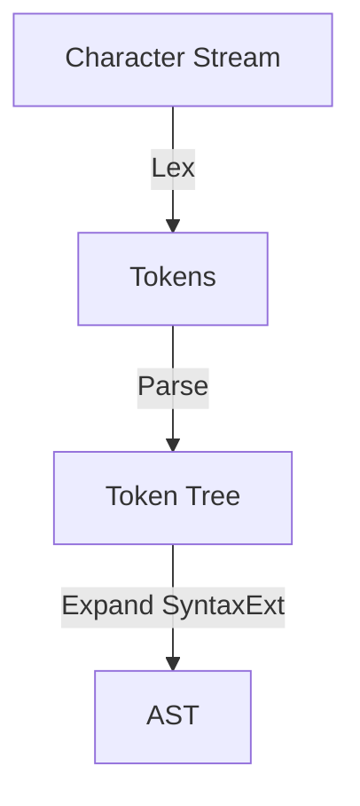

#Rust 
#metaprogramming
#macro


- [The Little Book of Rust Macros](https://veykril.github.io/tlborm/)
- [Macros - The Rust Programming Language](https://doc.rust-lang.org/book/ch19-06-macros.html)
- [Macros By Example - The Rust Reference](https://doc.rust-lang.org/reference/macros-by-example.html)
- [rfc: macro-metavar-expr](https://github.com/rust-lang/rfcs/blob/master/text/3086-macro-metavar-expr.md) retrieving info about metavariable  





# Kinds of Macro

>  Macro processing in Rust happens _after_ the construction of the _AST_, particular, after tokenization 

1. [[#Procedural Macro]] :  (incl. _pro-macro attribute_ & _derive attribute_)
    - `# [ $arg ]`; e.g. `#[derive(Clone)]`, `#[no_mangle]`
    - `# ! [ $arg ]`; e.g._ `#![allow(dead_code)]`, `#![crate_name="blang"]`
  2. [[#Declarative Macro]]  : i.e., _macro rules_.
      - `$name ! $arg`; e.g. `println!("Hi!")`, `concat!("a", "b")`


# Syntax Extension & Expansion
>[!DEFINITION] Syntax Extension
>
>The term *syntax extension* include the above macros together with built-in attribute.
>The result of expansion is a node in the _AST_.
>
> Syntax expansion happens in "passes"; as many as is needed to completely expand all invocations.

A _syntax extension_ can expand into any of the following:
-   an expression,
-   a pattern,
-   a type,
-   zero or more items, or
-   zero or more statements.

**Keeping hygiene** required identifiers cannot refer or be referred by the environment outside the syntax extension.


# Declarative Macro

###### A Template for Macro-rules

```rust
macro_rules! $name {
  $rule0 ;
  $rule1 ;
  ...
  ($matcher) => { $expansion } ;
}
```


>[!NOTE] Parenthesis
>
>- _macro def_: by _convention_, matchers are surrounded using `()` and expansions are surrounded with `{}`
>- _function-like macro call_: all kinds of parenthesis can be used to invoke a function-like macro  


## Matchers

> When a `macro_rules!` macro is invoked, the `macro_rules!` interpreter goes through the rules one by one, _in declaration order_.

```rust
( 
    // start a repetation
    $(
      $elem: expr  // some matcher
    )
    ,  // an optional seperator
    *  // a repeater
) => { 
    {
      let mut v = Vec::new();
      // start a repetation
      $(
        v.push($elem);
      )*  // repeat the above node
      v 
    }
}
```

- (_literals_): Matchers can contain literal token trees, which must be matched exactly. This is done by simply writing the token trees normally.
- (_metavariables_): **Captures** are written as a dollar (`$`) followed by an identifier, a colon (`:`) and a **fragment-specifier**, which are types of AST node or token. 
- (_repeat & separator_) 
  - separators are usually `,` or `;` 
  - repeaters are the same as regex


| Fragment-specifier | Meaning                                                                      |
| ------------------ | ---------------------------------------------------------------------------- |
| `block`            | a code block: `{ /* a block */ }`                                            |
| `expr`             | an expression                                                                |
| `ident`            | an identifier or keyword                                                     |
| `lifetime`         |                                                                              |
| `literal`          |                                                                              |
| `meta`             | a meta item; the things that go inside the `#[...]` and `#![...]` attributes |
| `pat`              | a pattern                                                                    |
| `path`             | a path (e.g. `foo`, `::std::mem::replace`, `transmute::<_, int>`, …)         |
| `stmt`             | a statement                                                                  |
| `tt`               | a single token tree                                                          |
| `ty`               | a type                                                                       |
| `vis`              | a possible empty visibility qualifier (e.g. `pub`, `pub(in crate)`, ...)     |


## Transcriber 

###### Metavariable Expression 

> _Metavariable expressions_ provide transcribers with information about metavariables that are otherwise not easily obtainable.

Two types of metavariable expression:
- `${ op() }`
- `$$` expression


## Internal Rules

```rust
#[macro_export]
macro_rules! foo {
    (@as_expr $e:expr) => {$e}; // this is an internal rule
    ($($tts:tt)*) => {
        foo!(@as_expr $($tts)*)
    };
}
```

The reason for using `@` was that, as of Rust 1.2, the `@` token is _not_ used in prefix position; as such, it cannot conflict with anything.


## Caveats

1. Once the parser begins consuming tokens for a metavariable, _it cannot stop or backtrack_. As such, it is important in general that you _write macro rules from most-specific to least-specific_.
2. The parser also does not perform any kind of lookahead.


# Procedural Macro

> A _procedural macro_ takes the form of a Rust function taking in a _token stream_(or two) and outputting a token stream.


## Kinds of proc-macros
- _function-like_ proc-macros which are used to implement `$name ! $arg` invocable macros
- _attribute_ proc-macros which are used to implement `#[$arg]` attributes
- _derive_ proc-macros which are used to implement a derive, an _input_ to a `#[derive(…)]` attribute

```rust
#[proc_macro]
pub fn my_proc_macro(input: TokenStream) -> TokenStream {
    ...
}

#[proc_macro_attribute]
pub fn my_attribute(input: TokenStream, annotated_item: TokenStream) -> TokenStream {
    ...
}

#[proc_macro_derive(MyDerive)]
pub fn my_derive(annotated_item: TokenStream) -> TokenStream {
    // The returned token stream will be appended to the containing block or module of the annotated item
}
```


