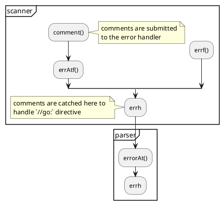

[source file](https://github.com/golang/go/tree/master/src/cmd/compile)

# go asm
[The Design of the Go Assembler - YouTube](https://www.youtube.com/watch?v=KINIAgRpkDA)

# Lexer

## [Lexical Scanning in Go - Rob Pike - YouTube](https://www.youtube.com/watch?v=HxaD_trXwRE)


### decision reasons

1. Existing tools like `lex` generates huge amounts of code even for simple lexing tasks, and error code for these tools are obscure and hard to understand.
2. RegEx is too slow and overkill for the problem

### state function: get rid of switch-stmt

> model state as a state that can do some action. 

state function is a function that returns state function.

```go

type lexer struct {
	input, name string
	items chan item
	startState stateFn
}

type stateFn func(*lexer) stateFn

// run lexes the input by executing state functions
// until the state is nil
func (lexer *lexer) run() {
	for state := lexer.startState; state != nil {
		state = state(lexer)
	}
	close(lexer.items)
}
```

### concurrent of lexer and parser

```go
func lex(name, input string) (*lexer, <-chan item) {
	lexer = &lexer {
		name: name,
		input: input,
		items: make(chan item),
	}
	go lexer.run()
	return lexer, lexer.items
}
```

### scanning

```
//                +------ content in use -------+
//                v                             v
// buf [...read...|...segment...|ch|...unread...|s|...free...]
//                ^             ^  ^            ^
//                |             |  |            |
//                b         r-chw  r            e
//
// Invariant: -1 <= b < r <= e < len(buf) && buf[e] == sentinel
```

before `b`, the buffered text is already lexed into tokens and submitted to the parser. A complete segment represents a full token, `r` is the position to need to advance to finish the segment. 


## compiler source code reading

lexer struct is defined at `syntax/scanner.go`
```go 
type scanner struct {
	source
	mode   uint
	nlsemi bool // if set '\n' and EOF translate to ';'

	// current token, valid after calling next()
	line, col uint
	blank     bool     // line is blank up to col
	tok       token    // type of the token
	lit       string   // valid if tok is _Name, _Literal, or _Semi ("semicolon", "newline", or "EOF"); may be malformed if bad is true
	bad       bool     // valid if tok is _Literal, true if a syntax error occurred, lit may be malformed
	kind      LitKind  // valid if tok is _Literal
	op        Operator // valid if tok is _Operator, _AssignOp, or _IncOp
	prec      int      // valid if tok is _Operator, _AssignOp, or _IncOp
}
```

using the scanner
```go
sc := new(scanner)
sc.init(src, err_fn) // initialize scanner

for {
	sc.next() // advances the scanner by reading the next token
	if sc.bad {
		sc.errorf(...) // report error
	}
	switch sc.tok {
	case _Name, _Literal, _Semi:
		doSomeThing(sc.lit)
	...	
	}
}
```

### reading runes from source file
`scanner.source` is responsible for reading `rune` or `char` from source files.

a segment holds a full token, thus must be kept fully in the buffer at `s.buf[b:e]`.

There are 2 facts of Unicode taken account here:
1. characters below `RuneSelf=0x80` are represented as themselves in a single byte. **ASCII has 128 characters from 0x00 to 0x7F, 0x80 represents no char in utf8**.
2. maximum number of bytes of a UTF-8 encoded Unicode character is `UTFMax=4`

Other functions from package `utf8`:
1. `utf8.FullRune func([]byte) bool` where this is a full rune
2. `ch, chWidth := utf8.DecodeRune(s.buf[s.r:s.e])`, decode rune from byte slice, slower than `rune(s.buf[s.r])`

```go
// The buffer content is terminated at buf[e] with the sentinel
// character utf8.RuneSelf. This makes it possible to test for
// the common case of ASCII characters with a single 'if' (see
// nextch method).
//
//                +------ content in use -------+
//                v                             v
// buf [...read...|...segment...|ch|...unread...|s|...free...]
//                ^             ^  ^            ^
//                |             |  |            |
//                b         r-chw  r            e
//
// Invariant: -1 <= b < r <= e < len(buf) && buf[e] == sentinel
type source struct {
	in   io.Reader
	errh func(line, col uint, msg string)

	buf       []byte // source buffer
	ioerr     error  // pending I/O error, or nil
	b, r, e   int    // buffer indices (see comment above)
	line, col uint   // source position of ch (0-based)
	ch        rune   // most recently read character
	chw       int    // width of ch
}

// nextch reads a rune from source.in to source.ch
// with source.chw the number of bytes the rune takes
func (s *source) nextch()
```

### tokenize
see `scanner.next()`


# Parser

![[Pasted image 20210929190010.png]]

```go
type parser struct {
	file  *PosBase
	errh  ErrorHandler
	mode  Mode
	pragh PragmaHandler
	scanner

	base   *PosBase // current position base
	first  error    // first error encountered
	errcnt int      // number of errors encountered
	pragma Pragma   // pragmas

	fnest  int    // function nesting level (for error handling)
	xnest  int    // expression nesting level (for complit ambiguity resolution)
	indent []byte // tracing support
}
```

> pragma is a synonym for directive, `parser.pragh` handles `//go:` directives,
> and stores the result in `parser.pragma`

```go
type Pragma interface{}
type PragmaHandler func(pos Pos, blank bool, text string, current Pragma) Pragma
```

## error report and pragma

#UML call graph of error report in golang parser


`scanner` reports a comment to its error handler and it need to be caught in `parser`.

```go
func (p *parser) init(..., r io.Reader, errh ErrorHandler, 
					  pragh PragmaHandler, ...) {
	...
	p.scanner.init(r, func(line, col uint, msg string) {
		// msg is a common error
		if msg[0] != '/' {
			p.errorAt(p.posAt(line, col), msg)
			return
		}
		//[note]: msg is a comment and may contains `//go:` directives
		text := commentText(msg) //[note]: commentText trims `//`, `/*`, `*/`
		...  //[note] handles common comment
		
		// go: directive (but be conservative and test)
		if pragh != nil && strings.HasPrefix(text, "go:") {
			//[note]: handles pragma or go directives
			p.pragma = pragh(p.posAt(line, col+2),
							 p.scanner.blank,
							 text, p.pragma) // +2 to skip over // or /*
		}
	})
}
```


### the position system 

## helper functions

```go
// got checks the next token type and discard the token
func (p *parser) got(tok token) bool {  
  	if p.tok == tok {  
		p.next()  
		return true  
	}  
	return false  
}  

// want reports an error if the next token's type is not 
// as expected
func (p *parser) want(tok token) {  
   if !p.got(tok) {  
		p.syntaxError("expecting " + tokstring(tok))  
		p.advance()  
   }  
}


func (p *parser) 
```

## parser entry point

```go
// ----------------------------------------------------------------------------  
// Package files  
//  
// Parse methods are annotated with matching Go productions as appropriate.  
// The annotations are intended as guidelines only since a single Go grammar  
// rule may be covered by multiple parse methods and vice versa.  
//  
// Excluding methods returning slices, parse methods named xOrNil may return  
// nil; all others are expected to return a valid non-nil node.  
  
// SourceFile = PackageClause ";" { ImportDecl ";" } { TopLevelDecl ";" } .

func (p *parser) fileOrNil() *File {  
	
	//[note]: trace is flag, bydefault `false`
	if trace {  
		defer p.trace("file")()  
	}  

	f := new(File)   //[note] File is type of root of the AST
	f.pos = p.pos()  
  	
	//[note] expect 'package' token, throw it away
    // PackageClause  
	if !p.got(_Package) {  
		p.syntaxError("package statement must be first")  
		return nil  
	}  
	f.Pragma = p.takePragma()  
	f.PkgName = p.name()  //[note] `p.name` reads out a `_Name` token
	p.want(_Semi)  
  
    // don't bother continuing if package clause has errors  
	if p.first != nil {   //[note] `p.first` is the first error
		return nil  
	}  
  
	// { ImportDecl ";" }  
	for p.got(_Import) {  
		f.DeclList = p.appendGroup(f.DeclList, p.importDecl)  
		p.want(_Semi)  
	}  
  
   // { TopLevelDecl ";" }  
	for p.tok != _EOF {  
		switch p.tok {  
		case _Const:  
			p.next()  
			f.DeclList = p.appendGroup(f.DeclList, p.constDecl)  
		case _Type:  
			p.next()  
			f.DeclList = p.appendGroup(f.DeclList, p.typeDecl)
		case _Var:  
			p.next()  
			f.DeclList = p.appendGroup(f.DeclList, p.varDecl)  
		case _Func:  
			p.next()  
			if d := p.funcDeclOrNil(); d != nil {  
				f.DeclList = append(f.DeclList, d)  
			}  
		default:  
	 		if p.tok == _Lbrace && len(f.DeclList) > 0 && isEmptyFuncDecl(f.DeclList[len(f.DeclList)-1]) {  
				// opening { of function declaration on next line  
				p.syntaxError("unexpected semicolon or newline before {")  
			} else {  
				p.syntaxError("non-declaration statement outside function body")  
			}  
			p.advance(_Const, _Type, _Var, _Func)  
			continue  
		}  
  
		// Reset p.pragma BEFORE advancing to the next token (consuming ';')  
 		// since comments before may set pragmas for the next function decl. p.clearPragma()  
  
		if p.tok != _EOF && !p.got(_Semi) {  
			p.syntaxError("after top level declaration")  
			p.advance(_Const, _Type, _Var, _Func)  
		}  
	}  
   // p.tok == _EOF  
  
	p.clearPragma()  
	f.EOF = p.pos()  
  
	return f  
}
```
