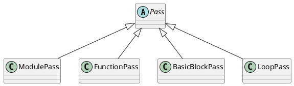

#book  #llvm

# Reference

- [The Architecture of Open Source Applications: LLVM](http://www.aosabook.org/en/llvm.html)
- [LLVM Essentials](https://learning.oreilly.com/library/view/llvm-essentials/9781785280801/)


# Chapter 1 Playing with LLVM

LLVM is implemented in C++ and the main crux of it is the LLVM core libraries it provides.  These libraries provide us with
1. _opt_ tool, 
2. the target independent _optimizer_, and
3. _code generation_ support for various target architectures.


## Modular Design of Optimization Passes

![[Pasted image 20211105144446.png]]

1. Each LLVM pass is written as a C++ class that derives (indirectly) from the `Pass` class.
2. Most passes are written in a single `.cpp` file, and their subclass of the `Pass` class is _defined in an anonymous namespace_ (which makes it completely private to the defining file). 
3. In order for the pass to be useful, code outside the file has to be able to get it, so _a single function (to create the pass) is exported from the file_. Here is a slightly simplified example of a pass to make things concrete.
4. When the optimizer is ran, the LLVM `PassManager` uses the explicitly mentioned dependency information and runs the passes in optimal way.


The code generator also makes use of this modular design like the **Optimizer**, for splitting the code generation into individual passes, namely, 
1. instruction selection
2. register allocation
3. scheduling
4. code layout optimization
5. assembly emission.

The compiler writer can modify each of the passes mentioned above and create custom target-specific passes. The use of the `tablegen` tool helps in achieving this using table description `.td` files for specific architectures.

Another capability that arises out of this is the ability to easily pinpoint a bug to a particular pass in the optimizer. A tool name `Bugpoint` makes use of this capability to automatically reduce the test case and pinpoint the pass that is causing the bug.


## Getting familiar with LLVM IR

This IR has three equivalent forms:

1.   An in-memory compiler IR
2.   An on-disk bit code representation
3.   A Human readable form (LLVM Assembly)

### Example

```c
int globvar = 12;

int add(int a) {
  return globvar + a;
}
```

```llvm
; ModuleID = 'add.c'
target datalayout = "e-m:e-i64:64-f80:128-n8:16:32:64-S128"
target triple = "x86_64-unknown-linux-gnu"

@globvar = global i32 12, align 4

; Function Attrs: nounwind uwtable
define i32 @add(i32 %a) #0 {
  %1 = alloca i32, align 4
  store i32 %a, i32* %1, align 4
  %2 = load i32, i32* @globvar, align 4
  %3 = load i32, i32* %1, align 4
  %4 = add nsw i32 %2, %3
  ret i32 %4
}

attributes #0 = { nounwind uwtable "less-precise-fpmad"="false" "no-frame-pointer-elim"="true" "no-frame-pointer-elim-non-leaf" "no-infs-fp-math"="false" "no-nans-fp-math"="false" "stack-protector-buffer-size"="8" "target-cpu"="x86-64" "unsafe-fp-math"="false" "use-soft-float"="false" }

!llvm.ident = !{!0}
Now let's look at the IR gen
```

1. An LLVM **module** is a _top–level data structure_ that has the entire contents of the input LLVM file. It consists of functions, global variables, external function prototypes, and symbol table entries.
2. The following lines show the **target data layout** and **target triple** from which we can know that the target is x86_64 processor with Linux running on it. The `datalayout` string tells us what is the endianess  of machine ('`e`' meaning little endian), and the name mangling (`m : e` denotes elf type). Each specification is separated by '`–`'and each following spec gives information about the type and size of that type. For example, `i64:64` says 64 bit integer is of 64 bits.     
3. Then we have a global variable `globvar`. _In LLVM IR all globals start with '`@`' and all local variables start with '`%`'._
4. _LLVM views **global variables** as pointers_, so an explicit dereference of the global variable using load instruction is required.
5. **Local variables** have two categories:
    1. **Register allocated local variables**, `%1 = some value`
    2. **Stack allocated local variables**, `%2 = alloca i32`. The `alloca` instruction gives _a pointer_ to the allocated type and explicit use of `load` and `store` instructions is required to access and store the value.
    
   
> Within the function is actual processing for functionality. Some important things to note here are that LLVM uses a **three-address instruction**, that is a data processing instruction, which has two source operands and places the result in a separate destination operand (`%4 = add i32 %2, %3`). Also the code is in [[SSA form]], that is each value in the IR has a single assignment which defines the value. This is useful for a number of optimizations.

## LLVM cmd line tools

- `llvm-as`: the LLVM assembler that takes LLVM IR in _assembly form_ (human readable) and converts it to _bit code format_. 
          
          llvm-as add.ll –o add.bc       
- `llvm-dis`: inverse of `llvm-as`

          llvm-dis add.bc –o add.ll
          
 - `llvm-link`: llvm-link links two or more llvm bit code files and outputs one llvm bit code file.
 - `lli`: `lli` directly executes programs in _LLVM bit code format_ using a just-in-time compiler or interpreter, if one is available for the current architecture. _`lli` is not like a virtual machine and cannot execute IR of different architecture and can only interpret for host architecture._
 - `llc`: `llc` is the _static compiler_. It compiles LLVM inputs (assembly form/ bit code form) into _assembly language_ for a specified architecture.
 - `opt`: This is modular _LLVM analyzer and optimizer_. It takes the input file and runs the optimization or analysis specified on the command line. Whether it runs the analyzer or optimizer depends on the command-line option.


# Chapter 2. Building LLVM IR

How a high-level language after parsing can be converted to LLVM IR using LLVM libraries.

> LLVM has an `IRBuilder` class that is used to _generate_ LLVM IR and print it using the `dump` function of the Module object.

### Create LLVM Module

```c++

#include "llvm/IR/LLVMContext.h"
#include "llvm/IR/Module.h"
using namespace llvm;


static LLVMContext &Context = getGlobalContext();
/*
 *  The first argument is the name of the module. 
 *  The second argument is `LLVMContext`.
 */
static Module *ModuleOb = new Module("my compiler", Context);


int main(int argc, char *argv[]) {
  ModuleOb->dump();
  return 0;
}

```

### Function

#### Emitting a function in a module


> LLVM provides the class `llvm::Function` to _create a function_ and `llvm::FunctionType()` to _associate a return type_ for the function. `llvm::verifyFunction()` performs a variety of consistency checks on the generated code, to determine if our compiler is doing everything right.

```c++
Function *createFunc(IRBuilder<> &Builder, std::string Name) {
  
  FunctionType *funcType = llvm::FunctionType::get(
    Builder.getInt32Ty(),
    false
  );
  
  Function *fooFunc = llvm::Function::Create(
    funcType, 
    llvm::Function::ExternalLinkage,
    Name,
    ModuleOb
  );
  
  return fooFunc;
}

int main(int argc, char *argv[]) {
  static IRBuilder<> Builder(Context);
  Function *fooFunc = createFunc(Builder, "foo");
  verifyFunction(*fooFunc);
  ModuleOb->dump();
  return 0;
}
```

#### Adding a [[basic block]] to a function

> LLVM provides the `BasicBlock` class to _create and handle_ basic blocks. We can use the `IRBuilder` object to hold new basic block IR.

```c++
BasicBlock *createBB(Function *fooFunc, std::string Name) {
  return BasicBlock::Create(Context, Name, fooFunc);
}

int main(int argc, char *argv[]) {
  static IRBuilder<> Builder(Context);
  Function *fooFunc = createFunc(Builder, "foo");
  
  BasicBlock *entry = createBB(fooFunc, "entry");
  Builder.SetInsertPoint(entry);
  
  verifyFunction(*fooFunc);
  ModuleOb->dump();
  return 0;
}
```
output:
```
; ModuleID = 'my compiler'

define i32 @foo() {
entry:
}
```


#### Emitting a global variable

**Global variables** have visibility of all the functions **within a given module**. **Linkage** is what determines if multiple declarations of the same object refer to the same object, or to separate ones.

```c++
GlobalVariable *createGlob(IRBuilder<> &Builder, std::string Name) 
{
  ModuleOb->getOrInsertGlobal(Name, Builder.getInt32Ty());
  GlobalVariable *gVar = ModuleOb->getNamedGlobal(Name);
  gVar->setLinkage(GlobalValue::CommonLinkage);
  gVar->setAlignment(4);
  return gVar;
}
```

> LLVM provides the `GlobalVariable` class to _create global variables_ and set its properties such as _linkage type, alignment_, and so on. The `Module` class has the method `getOrInsertGlobal()` to create a global variable. It takes two arguments—the first is the name of the variable and the second is the data type of the variable.

```c
// constructor
GlobalVariable( Module &M, Type *Ty,
                bool isConstant,           
                LinkageTypes Linkage,
                Constant *Initializer,
                const Twine &Name="", 
                GlobalVariable *InsertBefore=nullptr,
                ThreadLocalMode=NotThreadLocal,
                Optional<unsigned> AddressSpace=None, 
                bool isExternallyInitialized=false )
```
###### Linkage type

The LLVM reference manual cites the following types of Linkages:

| Type                         | Description                                         |
| ---------------------------- | --------------------------------------------------- |
| `ExternalLinkage`            | Externally visible function.                        |
| `AvailableExternallyLinkage` | Available for inspection, not emission.             |
| `LinkOnceAnyLinkage`         | Keep one copy of function when linking (inline)     |
| `LinkOnceODRLinkage`         | Same, but only replaced by something equivalent.    |
| `WeakAnyLinkage`             | Keep one copy of named function when linking (weak) |
| `WeakODRLinkage`             | Same, but only replaced by something equivalent.    |
| `AppendingLinkage`           | Special purpose, only applies to global arrays.     |
| `InternalLinkage`            | Rename collisions when linking (static functions).  |
| `PrivateLinkage`             | Like internal, but omit from symbol table.          |
| `ExternalWeakLinkage`        | `ExternalWeak` linkage description.                 |
| `CommonLinkage`              | Tentative definitions                               |


###### Thread local mode

see [[thread local storage]]

| Type                     | Description                                                    |
| ------------------------ | -------------------------------------------------------------- |
| `GeneralDynamicTLSModel` | default,                                                       |
| `LocalDynamicTLSModel`   | variables that are only used within the current shared library |
| `InitialExecTLSModel`    | variables in modules that will not be loaded dynamically       |
| `LocalExecTLSModel`      | variables defined in the executable and only used within it    |


###### Alignment

> Alignment gives information about address alignment. An alignment must be a power of `2`. **If not specified explicitly, it is set by the target.**


#### Constant Value

Can be done using the `Constant` class, normally using `IRBuilder` to create a `Constant` instance.

```c++
Value *constant = Builder.getInt32(0);
```

#### Emitting a return statement

A function might return a value or it may return void.

    Builder.CreateRet(Builder.getInt32(0));

```c++

int main(int argc, char *argv[]) {
  static IRBuilder<> Builder(Context);
  GlobalVariable *gVar = createGlob(Builder, "x");
  Function *fooFunc = createFunc(Builder, "foo");
  BasicBlock *entry = createBB(fooFunc, "entry");
  Builder.SetInsertPoint(entry);
  
  Builder.CreateRet(Builder.getInt32(0));
  
  verifyFunction(*fooFunc);
  ModuleOb->dump();
  return 0;
}

```


#### Emitting function arguments

This can be done by passing the Integer argument to the `functiontype`.

```c++

static std::vector <std::string> FunArgs;
FunArgs.push_back("a");
FunArgs.push_back("b");

// create function and set function type
Function *createFunc(IRBuilder<> &Builder, std::string Name) {
  
  std::vector<Type *> Integers(
    FunArgs.size(), Type::getInt32Ty(Context)
  );
  
  FunctionType *funcType = llvm::FunctionType::get(
    Builder.getInt32Ty(),    // return type
    Integers,                // argument type
    false
  );
  
  Function *fooFunc = llvm::Function::Create(
      funcType, llvm::Function::ExternalLinkage, Name, ModuleOb
  );
  
  return fooFunc;
}


// set function argument name
void setFuncArgs(Function *fooFunc, std::vector<std::string> FunArgs) 
{
  unsigned Idx = 0;
  Function::arg_iterator AI, AE;
  
  for (AI = fooFunc->arg_begin(), AE = fooFunc->arg_end();
       AI != AE;
       ++AI, ++Idx) 
  {
    AI->setName(FunArgs[Idx]);  
  }
  
}
```

output:

```
; ModuleID = 'my compiler'

@x = common global i32, align 4

define i32 @foo(i32 %a, i32 %b) {
entry:
  ret i32 0
}
```

#### Arithmetic operation
```c++

Value *createArith(IRBuilder<> &Builder, Value *L, Value *R) {
  return Builder.CreateMul(
    L,
    R,
    "multmp"  // name of the returned variable
  );
}
```


### Control flow

#### Emitting if-else condition IR


> A **[[phi instruction]]** takes various values coming from different basic blocks and decides which value to assign depending on the condition expression.


```c++
// a < 100
Value *val2 = Builder.getInt32(100);
Value *Compare = Builder.CreateICmpULT(val, val2, "cmptmp");

// For reusability, we create `BasicBlock` and `Value`
// containers as follows:
typedef SmallVector<BasicBlock *, 16> BBList;
typedef SmallVector<Value *, 16> ValList;

// value for comparison
Value *Condtn = Builder.CreateICmpNE(
  Compare, Builder.getInt32(0),"ifcond"
);
ValList VL;
VL.push_back(Condtn);
VL.push_back(Arg1);


// create basic blocks
BasicBlock *ThenBB  = createBB(fooFunc, "then");
BasicBlock *ElseBB  = createBB(fooFunc, "else");
BasicBlock *MergeBB = createBB(fooFunc, "ifcont");
BBList List;
List.push_back(ThenBB);
List.push_back(ElseBB);
List.push_back(MergeBB);

```


```c++

Value *createIfElse(IRBuilder<> &Builder, BBList List, ValList VL) {
  
  Value *Condtn = VL[0];
  Value *Arg1 = VL[1];
  
  BasicBlock *ThenBB = List[0];
  BasicBlock *ElseBB = List[1];
  BasicBlock *MergeBB = List[2];
  
  // emit cond ir
  Builder.CreateCondBr(Condtn, ThenBB, ElseBB);

  Builder.SetInsertPoint(ThenBB);
  Value *ThenVal = Builder.CreateAdd(
    Arg1, Builder.getInt32(1), "thenaddtmp"
  );
  Builder.CreateBr(MergeBB);   // jmp over else bock

  Builder.SetInsertPoint(ElseBB);
  Value *ElseVal = Builder.CreateAdd(
    Arg1, Builder.getInt32(2), "elseaddtmp"
  );
  Builder.CreateBr(MergeBB);

  unsigned PhiBBSize = List.size() - 1;
  Builder.SetInsertPoint(MergeBB);
  
  
  // %iftmp = phi i32 [ %thenaddtmp, %then ], [ %elseaddtmp, %else ]
  PHINode *Phi = Builder.CreatePHI(
    Type::getInt32Ty(getGlobalContext()),
    PhiBBSize,
    "iftmp");
  Phi->addIncoming(ThenVal, ThenBB);
  Phi->addIncoming(ElseVal, ElseBB);

  return Phi;
}
```

```
; ModuleID = 'my compiler'

@x = common global i32, align 4

define i32 @foo(i32 %a, i32 %b) {
entry:
  %multmp = mul i32 %a, 16
  %cmptmp = icmp ult i32 %multmp, 100
  %ifcond = icmp ne i1 %cmptmp, i32 0
  br i1 %ifcond, label %then, label %else

then:                                             ; preds = %entry
  %thenaddtmp = add i32 %a, 1
  br label %ifcont

else:                                             ; preds = %entry
  %elseaddtmp = add i32 %a, 2
  br label %ifcont

ifcont:                                           ; preds = %else, %then
  %iftmp = phi i32 [ %thenaddtmp, %then ], [ %elseaddtmp, %else ]
  ret i32 %iftmp
}
```


#### Emitting LLVM IR for loop

```
loop:                              ; preds = %loop, %entry
  %i = phi i32 [ 1, %entry ], [ %nextval, %loop ]
  %addtmp = add i32 %a, 5
  %nextval = add i32 %i, 1
  %endcond = icmp ult i32 %i, %b
  %loopcond = icmp ne i1 %endcond, i32 0
  br i1 %loopcond, label %loop, label %afterloop
```


# Chapter 3. Advanced LLVM IR (LLVM IR which involve memory operations)

###  Memory access operations

> The ‘`getelementptr`’ instruction is used to get the address of a sub-element of an _aggregate_ data structure. It performs address calculation only and does not access memory. The instruction can also be used to calculate a vector of such addresses.


    <result> = getelementptr <ty>, <ty>* <ptrval>{, [inrange] <ty> <idx>}*
    <result> = getelementptr inbounds <ty>, <ty>* <ptrval>{, [inrange] <ty> <idx>}*
    <result> = getelementptr <ty>, <ptr vector> <ptrval>, [inrange] <vector index type> <idx>
    
    
```c++
Value *getGEP(IRBuilder<> &Builder, Value *Base, Value *Offset) {
  return Builder.CreateGEP(
    Builder.getInt32Ty(), Base, Offset, "a1"
  );
}
```

> In LLVM the `load` instruction is used to read from a memory location.

    %val = load i32, i32* a1
    
```c++
Value *getLoad(IRBuilder<> &Builder, Value *Address) {
  return Builder.CreateLoad(Address, "load");
}
```


> LLVM uses the `store` instruction to write into a memory location.

    store i32 3, i32* %a1

```c++
void getStore(IRBuilder<> &Builder, Value *Address, Value *V) {
  Builder.CreateStore(V, Address);
}
```


### Vector

LLVM also provides the API to emit an instruction, which inserts a scalar into a **vector type**.

Vector types are used when multiple primitive data are operated in parallel using **single instruction multiple data** ([[SIMD]])

#### Inserting a scalar into a vector


    %vec0 = insertelement <4 x double> Vec, %val0, %idx

```c++
Value *getInsertElement(IRBuilder<> &Builder, Value *Vec, Value *Val,
                        Value *Index) {
  return Builder.CreateInsertElement(Vec, Val, Index);
}
```

```c++
Value *getExtractElement(IRBuilder<> &Builder, Value *Vec, Value *Index) 
{
  return Builder.CreateExtractElement(Vec, Index);
}

```


# Chapter 4. Basic IR Transformations

### Opt Tool

**Opt** is the LLVM Optimizer and analyzer tool that is run on LLVM IR to optimize the IR or produce an analysis about it.


### Pass and Pass Manager
#UML 



```c++
#include "llvm/Pass.h"
#include "llvm/IR/Function.h"
#include "llvm/Support/raw_ostream.h"

using namespace llvm;

namespace {
  struct FnNamePrint: public FunctionPass {
    static char ID;
    FnNamePrint () : FunctionPass(ID) {}
    bool runOnFunction(Function &F) override {
      errs() << "Function " << F.getName() << '\n';
      return false;
    }
  };
}

// declare the `ID` for the pass,
//   which is used to identify the pass:
char FnNamePrint::ID = 0;

// Finally, we need to register the passes
//   with the Pass Manager.
static RegisterPass<FnNamePrint> X(
  "funcnameprint",   // `opt` tool to identify this pass.
  "Function Name Print",  // actual Pass name
  false,  // whether the pass modified the `cfg`
  false   // whether it is an analysis pass
);

```

```bash
$ opt -load path-to-llvm/build/lib/FnNamePrint.so -funcnameprint test.ll
```

#### Pass Manager

The `PassManager` class schedules the passes to be run efficiently.

- A pass itself can specify the _dependency_ on other passes
- A pass itself can specify the passes that will be _invalidated_ by the execution of the current pass.

> The main work of the `PassManager` is to avoid the calculation of analysis results time and again. #lizy

- The `PassManager` also specifies the `–debug-pass` option with which we can see how one pass interacts with other passes.


#### Using other Pass info in current Pass

```c++
void getAnalysisUsage(AnalysisUsage &AU) const override {
  // AliasAnalysis runs prior to this pass
  AU.addRequired<AliasAnalysis>();  
  …
  /*
  when we need to preserve the order 
    in which the analysis passes are run we use this method.
  */
  AU.addRequiredTransitive<AliasAnalysis>();
  AU.addRequiredTransitive<ScalarEvolution>();
  AU.addRequiredTransitive<LoopInfo>();
  …
  // result of AliasAnalysis is preserved after this pass
  AU.addPreserved<AliasAnalysis>();
}
```


#### Instruction Combining

> _Instruction combining_ is a LLVM Pass and compiler technique in which we replace a sequence of instructions with instructions that are more effective and give the same result on execution in a smaller number of machine cycles.

The LLVM page states that this pass guarantees that the following canonicalizations are performed on the program:

-   Constant operand of a binary operator is moved to RHS.
-   Bitwise operators with constant operands are grouped together with shifts being performed first then 'or' operations, 'and' operations and then 'xor operations'
-   If possible, comparison operators are converted from <,>,<=,>= to == or != .
-   All `cmp` instructions operating on Boolean values are replaced with logical operations.
-   Add X, X is represented by `X*2` , that is `X<<1`
-   Multipliers with a power-of-two constant argument are transformed into shifts.

# Chapter 5. Advanced IR Block Transformations

### Loop processing

- **Loop Invariant Code Motion** (**LICM**) optimization
- **Loop Rotation**
- **Loop Interchange**
- **Loop Unswitch**

### Scalar evolution

### LLVM intrinsics

> An intrinsic function is a function built in to the compiler.


[LLVM intrinsic-functions](https://llvm.org/docs/LangRef.html#intrinsic-functions)

[LLVM trampoline-intrinsics](https://llvm.org/docs/LangRef.html#trampoline-intrinsics)


The compiler knows how to best implement the functionality in the most optimized way for these functions and replaces with a set of machine instruction for a particular backend. 

Often, the code for the function is inserted _inline_ thus avoiding the overhead of function call

In LLVM these intrinsics are introduced during code optimization at IR level (Intrinsics written in program code can be emitted through frontend directly). These function names will start with a prefix "`llvm.`", which is a reserved word in LLVM.
