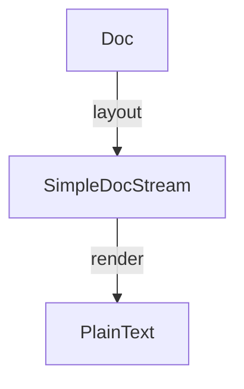
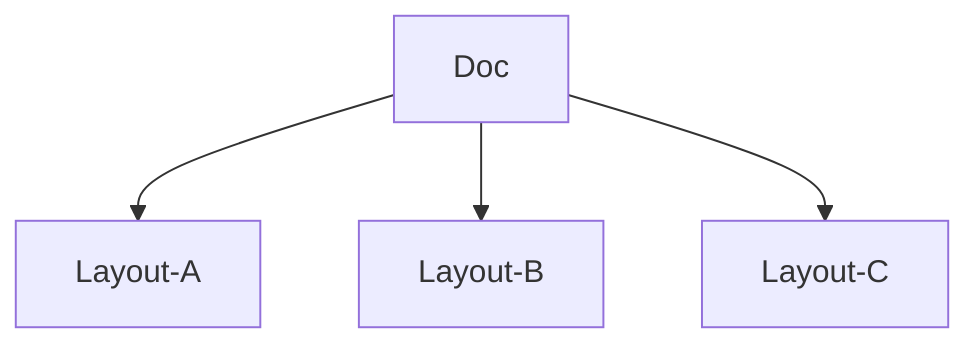

#Haskell 

# Theory

A _pretty printer_ is a tool, often a library of routines, that aids in converting a **tree** into **text**.

The new library is based on a single way to concatenate documents, which is **associative** and **has a left and right unit.**

## Basic Operators

```haskell
-- | concats 2 docs
(<>) :: Doc -> Doc -> Doc
nil  :: Doc
text :: String -> Doc
-- | denotes a line break
line :: Doc 
-- | adds indentation to a doc
nest :: Int -> Doc -> Doc
layout :: Doc -> String 
```

>[!warning] 
> Be careful with the `nest` function.
>
> The function `nest` adds **extra** indentation to the doc; however,
>  - _indentation is only added from next explicit newline, not the current one_.
>  - _indentation only added to only the doc of the arg_ not all following docs.
> ```haskell
> vsep [nest 4 (vsep ["lorem", "ipsum", "dolor"])
>      ,"sit"
>      ,"amet" ]
> {- prints:
> lorem
>     ipsum
>     dolor
> sit
> amet
> -}
> ```
> Note that 
> - "lorem" is not indented
> - "sit" and "amet" are not indented

## Normal Form

Every document can be reduced to a normal form with _line breaks nested to a given indentation_:
```haskell
text s0 <>
  nest i1 line <> test s1 <>
    nest i2 line <> test s2 <> 
    ...
      nest ik line <> text sk
```

if the follow laws are satisfied 
```haskell
text (s ++ t) = text s <> text t
text "" = nil

nest (i + j) = (nest i) . (nest j)
nest 0 = id

nest i (x <> y) = nest i x <> nest i y
nest i nil = nil

(nest i) . text = text  -- nest only take effect after line break
```

All but the last law come in pairs: each law on a binary operator is paired with a corresponding law for its unit.

In reducing a term to normal form, the first four laws are applied left to right, while the last three are applied right to left.

```haskell

data Doc = Text String | Nil | Line | Nest Int Doc | Concat Doc Doc

toNormalForm :: Doc -> Doc 
toNormalForm t@(Text _)          = t
toNormalForm Nil                 = Text ""
toNormalForm Line                = Line
toNormalForm (Nest i (Nest j x)) = toNormalForm $ Nest (i + j) x 
toNormalForm (Nest i x)          = Nest i (toNormalForm x)
...
```

## Layout & Alternative Layouts



### Doc

`layout` converts a `Doc` to a `String` with follow laws reflex the semantics of other basic operations

```haskell
layout (x <> y) = layout x ++ layout y
layout nil = ""
layout (text s) = s
layout (nest i line) = '\n' : copy i ' '
```

the laws are complete due to the normal form

>[!def] document
> Conceptually we view a document as _a set of strings_, each corresponding to a _different layout_ of the same content.



```haskell

-- | Choose the prettiest among of a set of layouts
prettyPrint 
  :: Int     -- preffered maximum line width
  -> Doc     -- Doc: set of layout options
  -> String  -- output string
       
data Doc 
  = Fail 
  | Empty 
  -- ^ unit of Concat
  | Concat Doc Doc
  | Text String
  | Line
  | Nest Int Doc 
  -- ^ concat horizontally
  | Nesting (Int -> Doc)
  | Column  (Int -> Doc)
  -- ^ layout a doc given which col it starts at
  | WithPageWidth (PageWidth -> Doc)
  | FlatAlt Doc Doc
  -- ^ use first doc unless flattened with `group`
  | Union Doc Doc
  -- ^ used by `group`

instance Semigroup Doc where
  a <> b = Concat a b
instance Monoid Doc where
  mempty = Empty
```


### Layout

```haskell
-- | type a is option for layout
type Layout a = a -> Doc -> SimpleDocStream

data SimpleDocStream 
  = SFail 
  | SEmpty
  -- ^ render nothing
  | SText { sContent :: !Text, sNext :: SimpleDocStream }
  -- ^ put sContent then render sNext 
  | SLine { sIndentLevel :: !Int, sNext :: SimpleDocStream }
  -- ^ Return carriage and put sIndentLevel spaces then render sNext

layoutPretty :: Layout Int  
layoutPretty pageWidth doc = go 0 0 doc sEmpty
 where 
  go :: Int -> Int -> Doc -> SimpleDocStream -> SimpleDocStream 
  go currNest currCol currDoc streamTail = case currDoc of
    Fail   -> SFail 
    Empty  -> streamTail
    Text s -> SText s streamTail
    Line   -> let rest = go nestLevel nestLevel xs
              in SLine currNest nestLevel 
  fits :: Int -> Int -> SimpleDocStream -> Bool
  fits currIndent currCol 
```


> [!tldr]
> Given a document, representing a set of layouts, `group` returns the set with one new element added, representing the layout in which _everything is compressed on one line_.

```haskell
group :: Doc -> Doc
gourp x = case x of 
  Union _ _ -> x
  FlatAlt a b -> case go b of 
    Right b'   -> Union b' a
    Left True  -> Union b a
    Left False -> a
  _ -> case go x of 
    Right x' -> Union x' x
    Left  _  -> x
 where 
  go :: Doc -> Ether Bool Doc
  go = _
    


-- auxiliary operators

-- | union 2 set of layouts
(<|>) :: Doc -> Doc -> Doc
-- | make a single layout set by replacing 
-- line breaks to spaces
flatten :: Doc -> Doc
```

# The `prettyprinter` package

[prettyprinter -- Hackage](https://hackage.haskell.org/package/prettyprinter)

## Concept

- maximum width: width of the page
- ribbon width: line length without the leading indentation. he _layouters_ take a ribbon fraction argument, which specifies how much of a line should be filled before trying to break it up.
- grouping: A document can be `group`ed, which tells the _layouter_ that it should attempt to collapse it to a single line.


