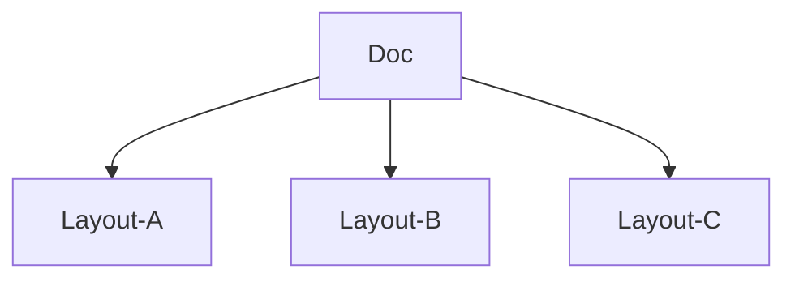

#Haskell 

# Theory

A _pretty printer_ is a tool, often a library of routines, that aids in converting a **tree** into **text**.

The new library is based on a single way to concatenate documents, which is **associative** and **has a left and right unit.**

## Basic Operators

```haskell
-- | concats 2 docs
(<>) :: Doc -> Doc -> Doc
nil  :: Doc
text :: String -> Doc
-- | denotes a line break
line :: Doc 
-- | adds indentation to a doc
nest :: Int -> Doc -> Doc
layout :: Doc -> String 
```

## Normal Form

Every document can be reduced to a normal form with _line breaks nested to a given indentation_:
```haskell
test s0 <>
  nest i1 line <> test s1 <>
    nest i2 line <> test s2 <> 
    ...
      nest ik line <> text sk
```

if the follow laws are satisfied 
```haskell
text (s ++ t) = text s <> text t
text "" = nil

nest (i + j) = (nest i) . (nest j)
nest 0 = id

nest i (x <> y) = nest i x <> nest i y
nest i nil = nil

(nest i) . text = text  -- nest only take effect after line break
```

All but the last law come in pairs: each law on a binary operator is paired with a corresponding law for its unit.

In reducing a term to normal form, the first four laws are applied left to right, while the last three are applied right to left.

```haskell

data Doc = Text String | Nil | Line | Nest Int Doc | Concat Doc Doc

toNormalForm :: Doc -> Doc 
toNormalForm t@(Text _)          = t
toNormalForm Nil                 = Text ""
toNormalForm Line                = Line
toNormalForm (Nest i (Nest j x)) = toNormalForm $ Nest (i + j) x 
toNormalForm (Nest i x)          = Nest i (toNormalForm x)
...
```

## Layout & Alternative Layouts

`layout` converts a `Doc` to a `String` with follow laws reflex the semantics of other basic operations

```haskell
layout (x <> y) = layout x ++ layout y
layout nil = ""
layout (text s) = s
layout (nest i line) = '\n' : copy i ' '
```

the laws are complete due to the normal form

> Whereas before we might view a _document_ as equivalent to a string, now we will view it as equivalent to a set of strings, each corresponding to a different layout of the same document.



The following is just an example

```haskell
-- | Given a document, representing a set of layouts, 
-- group returns the set with one new element added, 
-- representing the layout in which everything 
-- is compressed on one line.
group :: Doc -> Doc
gourp x = flatten x <|> x

-- | Choose the prettiest among of a set of layouts
pretty :: Int     -- preffered maximum line width
       -> Doc     -- Doc: set of layout options
       -> String  -- output string

-- auxiliary operators

-- | union 2 set of layouts
(<|>) :: Doc -> Doc -> Doc
-- | make a single layout set by replacing 
-- line breaks to spaces
flatten :: Doc -> Doc
```

# The `prettyprinter` package

[prettyprinter -- Hackage](https://hackage.haskell.org/package/prettyprinter)

## Concept

- maximum width: width of the page
- ribbon width: line length without the leading indentation. he _layouters_ take a ribbon fraction argument, which specifies how much of a line should be filled before trying to break it up.
- grouping: A document can be `group`ed, which tells the _layouter_ that it should attempt to collapse it to a single line.


```haskell
data Doc ann 
```